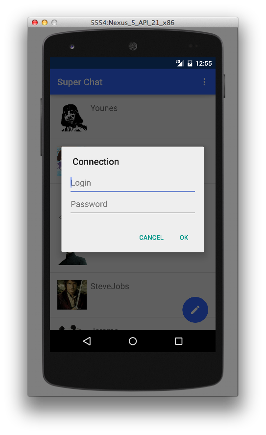
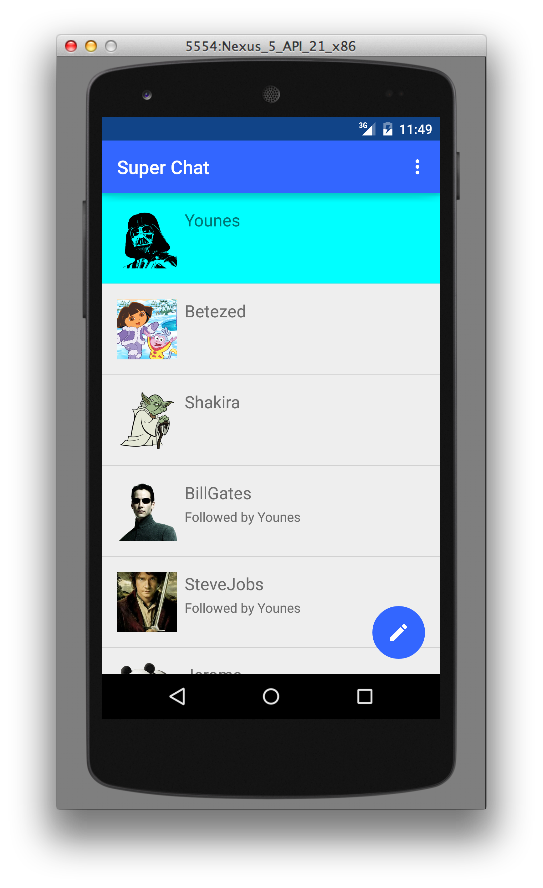
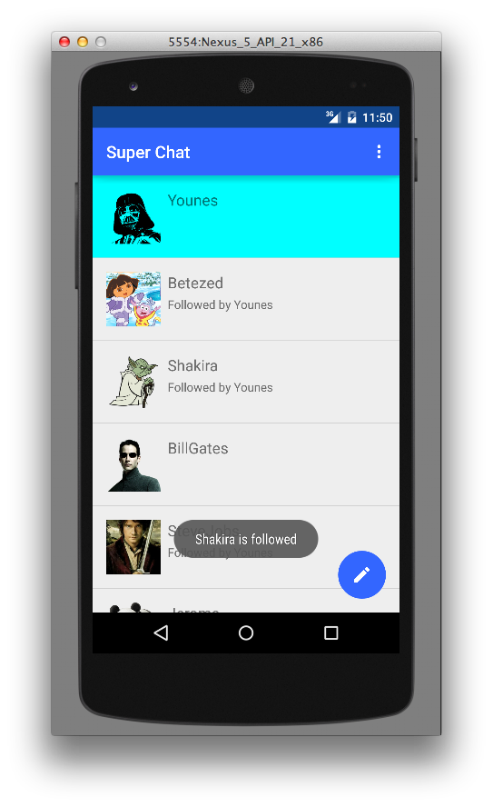
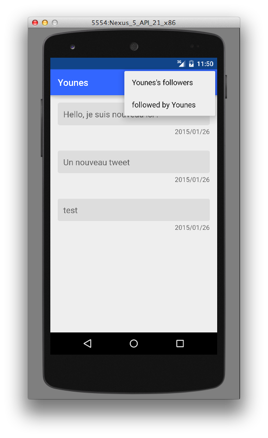
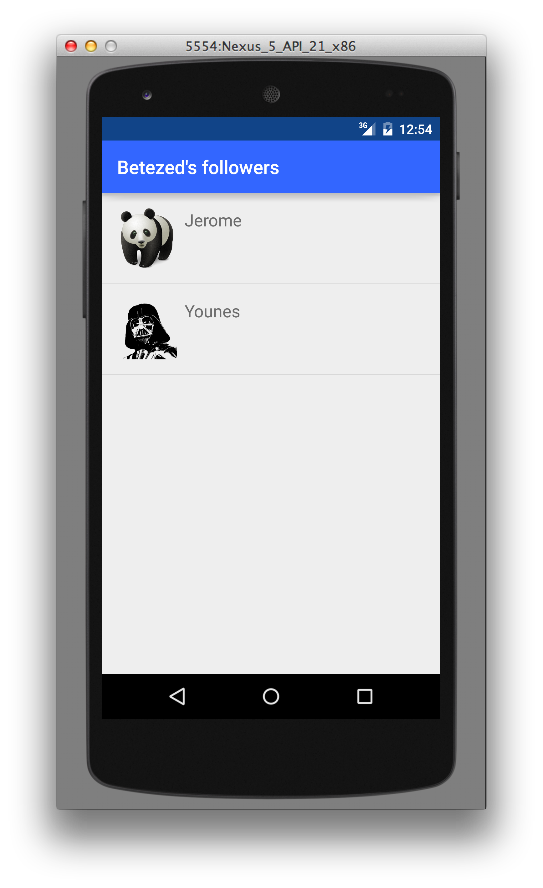

<h3>QuickTweet:</h3>
Pour suivre/désuivre un utilisateur, il faut être connecté.
Si l'application est lancée pour la première fois, l'interface d'authentification apparaît en premier:
 
Une fois authentifié, la case de utilisateur sera colorée en bleu:
 
l'utilisateur authentifié peut suivre/désuivre un autre utilisateur parmi la liste avec <b>un click long</b> sur le row:
 
On afficher les followers/followings de chaque utilisateur à partir du menu des tweets:
 
l'utilisateur authentifié peut désuivre un followings à partir de la liste des followings
 

