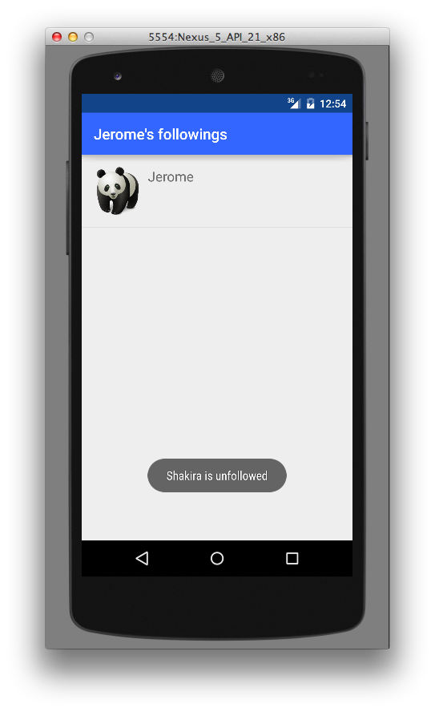

##QuickTweet:
Pour suivre/désuivre un utilisateur, il faut être connecté.

Si l'application est lancée pour la première fois, l'interface d'authentification apparaît en premier:

Une fois authentifié, la case de utilisateur sera colorée en bleu:

L'utilisateur authentifié peut suivre/désuivre un autre utilisateur parmi la liste avec **un click long** sur le row:

On peut afficher les followers/followings de chaque utilisateur à partir du menu des tweets:

L'utilisateur authentifié peut désuivre un followings à partir de la liste des followings

